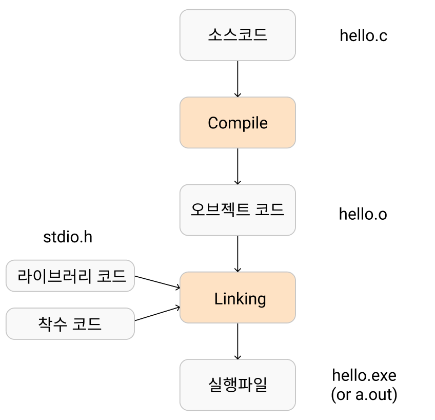

## 1. C 프로그램의 빌드 절차

### 1.1. 빌드란?

hello.c 같은 소스코드 파일을 실행 가능한 파일로 만드는 일련의 과정을 말한다.

### 1.2. 빌드 절차



 1.  컴파일 : 소스파일들을 각각 컴파일하여 Object파일(*.o)을 생성한다.

 2.  링크 : Object파일들을 하나로 묶는 과정을 통해서 실행파일(*.exe or *.out)을 생성한다. 

	이때 헤더 파일과 같은 라이브러리 코드들을 가져다가 함께 엮어준다. 또한 착수코드(start-up code)를 함께 엮어주는데 착수코드란 프로그램이 기본적으로 시작할 때 필요한 공통적인 작없을 미리 세팅해둔 코드이다. 예를들어 메모리 할당 하는 코드가 착수코드에 정의 되어있다.


## 2. 빌드 해보기

### 2.1. 소스코드 파일 만들기

**hello.c**

```c
#include <stdio.h>

int main(void)
{
    printf("hello, world!\n");
    return 0;
}
```


### 2.2. object 파일 생성 (컴파일)

```c
$gcc -c -o hello.o hello.c
```

hello.c파일로 hello.o 파일을 생성한다.

`-c` 옵션은 링킹 과정을 진행 하지 않고 .o 파일인 오브젝트 파일까지만 생성하게 된다.

`-o` 옵션은 출력파일명을 지정할 때 사용한다. (hello.o 라고 지정)


### 2.3. 실행 파일 생성 (링크)

```c
$gcc -o a.out hello.c
```


## 3. 실행파일 실행해보기

```
$./a.out
hello, world!
```


## 참고

> https://ssinyoung.tistory.com/2
>
> https://gracefulprograming.tistory.com/16
>
> https://brunch.co.kr/@mystoryg/57