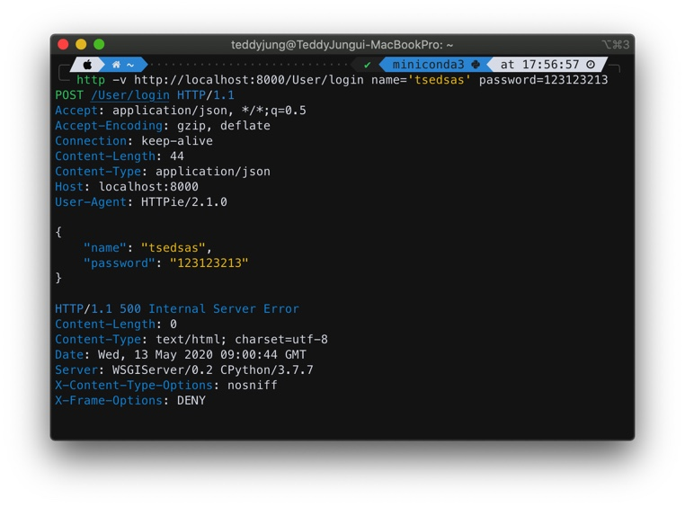

## HTTP의 구조와 개념

> 참고 사이트
>
> https://velog.io/@teddybearjung/HTTP-%EA%B5%AC%EC%A1%B0-%EB%B0%8F-%ED%95%B5%EC%8B%AC-%EC%9A%94%EC%86%8C
>
> https://sjh836.tistory.com/81

## 1. HyperText Transfer Protocol

- 하이퍼텍스트(HTML) 문서를 교환하기 위해 만들어진 protocol(통신 규약).
- 즉 웹상에서 네트워크로 서버끼리 통신을 할때 어떠한 형식으로 서로 통신을 하자고 규정해 놓은 "통신 형식" 혹은 "통신 구조" 라고 보면 된다.
	프론트앤드 서버와 클라이언트간의 통신에 사용된다.
	또한 백앤드와 프론트앤드 서버간에의 통신에도 사용된다.
- HTTP는 TCP/IP 기반으로 되어있다.

## 2. HTTP 핵심 요소

### 2-1. HTTP 통신 방식

- HTTP 기본적으로 요청/응답 (request/response) 구조로 되어있다.
	클라이언트가 HTTP request를 서버에 보내면 서버는 HTTP response를 보내는 구조.
	클라이언트와 서버의 모든 통신이 요청과 응답으로 이루어 진다.

- HTTP는 Stateless 이다.
	Stateless 란 말그대로 state(상태)를 저장하지 않는 다는 뜻.
	즉, 요청이 오면 그에 응답을 할뿐, 여러 요청/응답 끼리 연결되어 있지 않다는 뜻이다. 즉 각각의 요청/응답은 독립적인 요청/응답 이다.
	예를 들어, 클라이언트가 요청을 보내고 응답을 받은후, 조금 있다 다시 요청을 보낼때, 전에 보낸 요청/응답에 대해 알지 못한다는 뜻이다.
	그래서 만일 여러 요청과응답 의 진행과정이나 데이터가 필요할때는 쿠키나 세션 등등을 사용하게 된다.

	### * cookie

	: 웹 브라우저가 웹사이트에서 보내온 정보를 저장할 수 있도록 하는 조그마한 파일

	### * session

	: 쿠키와 마찬가지로 HTTP 통신상에서 필요한 데이터를 저장할 수 있게 하는 메커니즘.
	쿠키와의 차이점은 쿠키는 웹 브라우저, 즉 클라이언트 측에서 데이터를 저장하는 반면에 세션은 웹 서버에서 데이터를 저장한다.

### 2-2. HTTP Request 구조

HTTP request 메세지는 크게 3부분으로 구성된다:

- start line
- headers
- body

### 2-2-1. Start Line

말 그대로 HTTP request의 첫 라인(이름이 너무 식상하지만, 뭐 이미 이렇게 지어졌다).
HTTP request의 start line또한 3부분으로 구성되어 있음.


> 예시 ) GET /search HTTP/1.1

- HTTP Method
	해당 request가 의도한 action을 정의하는 부분.
	HTTP Methods에는 GET, POST, PUT, DELETE, OPTIONS 등등이 있다.
	주로 GET 과 POST과 쓰임.
- Request target
	해당 request가 전송되는 목표 uri.
	예를 들어 /login.
- HTTP Version
	말 그대로 사용되는 HTTP 버젼. 버젼에는 1.0, 1.1, 2.0 등이 있다.

### 2-2-2. Headers

- 해당 request에 대한 추가 정보(addtional information)를 담고 있는 부분.
	예를 들어, request 메세지 body의 총 길이 (Content-Length) 등.
- Key:Value 값으로 되어있다 (: 이 사용됨).
	key:value
	HOST: google.com => Key = HOST, Value = google.com
- Headers도 크게 3부분으로 나뉘지만(general headers, request headers, entity headers) 너무 자세한 부분임으로, 3부분 으로 구성되어 있다는것만 알고 있어도 괜찮다.

```python
Accept: */*
Accept-Encoding: gzip, deflate
Connection: keep-alive
Content-Type: application/json
Content-Length: 257
Host: google.com
User-Agent: HTTPie/0.9.3
```

자주 사용되는 header 정보에는 다음이 있다:

- Host
	요청이 전송되는 target의 host url: 예를 들어, google.com
- User-Agent
	요청을 보내는 클라이언트의 대한 정보: 예를 들어, 웹브라우저에 대한 정보.
- Accept
	해당 요청이 받을 수 있는 응답(response) 타입.
- Connection
	해당 요청이 끝난후에 클라이언트와 서버가 계속해서 네트워크 컨넥션을 유지 할것인지 아니면 끊을것인지에 대해 지시하는 부분.
- Content-Type
	해당 요청이 보내는 메세지 body의 타입. 예를 들어, JSON을 보내면 application/json.
- Content-Length:
	메세지 body의 길이.

### 2-2-3. Body

해당 reqeust의 실제 메세지/내용.
Body가 없는 request도 많다.
예를 들어, GET request들은 대부분 body가 없는 경우가 많음.

```python
POST /payment-sync HTTP/1.1

Accept: application/json
Accept-Encoding: gzip, deflate
Connection: keep-alive
Content-Length: 83
Content-Type: application/json
Host: intropython.com
User-Agent: HTTPie/0.9.3

{
    "imp_uid": "imp_1234567890",
    "merchant_uid": "order_id_8237352",
    "status": "paid"
}
```

### 2-2-4. HTTP Response 구조

Response도 request와 마찬가지로 크게 3부분으로 구성되어 있다.

- Status line
- Headers
- Body

### 2-2-5. Status Line

Response의 상태를 간략하게 나타내주는 부분.
3부분으로 구성되어 있다.

- HTTP 버젼

- Status code: 응답 상태를 나타내는 코드. 숫자로 되어 있는 코드.
	예를 들어, 200

- Status text: 응답 상태를 간략하게 설명해주는 부분.

	예를 들어, "Not Found"

	> HTTP/1.1 404 Not Found

### 2-2-6. Headers

- Response의 headers와 동일하다.
- 다만 response에서만 사용되는 header 값들이 있다.
- 예를 들어, User-Agent 대신에 Server 헤더가 사용된다.

### 2-2-7. Body

- Response의 body와 일반적으로 동일하다.
- Request와 마찬가지로 모든 response가 body가 있지는 않다. 데이터를 전송할 필요가 없을경우 body가 비어있게 된다.

```python
HTTP/1.1 404 Not Found

Connection: close
Content-Length: 1573
Content-Type: text/html; charset=UTF-8
Date: Mon, 20 Aug 2018 07:59:05 GMT

<!DOCTYPE html>
<html lang=en>
  <meta charset=utf-8>
  <meta name=viewport content="initial-scale=1, minimum-scale=1, width=device-width">
  <title>Error 404 (Not Found)!!1</title>
  <style>
    *{margin:0;padding:0}html,code{font:15px/22px arial,sans-serif}html{background:#fff;color:#222;padding:15px}body{margin:7% auto 0;max-width:390px;min-height:180px;padding:30px 0 15px}* > body{background:url(//www.google.com/images/errors/robot.png) 100% 5px no-repeat;padding-right:205px}p{margin:11px 0 22px;overflow:hidden}ins{color:#777;text-decoration:none}a img{border:0}@media screen and (max-width:772px){body{background:none;margin-top:0;max-width:none;padding-right:0}}#logo{background:url(//www.google.com/images/branding/googlelogo/1x/googlelogo_color_150x54dp.png) no-repeat;margin-left:-5px}@media only screen and (min-resolution:192dpi){#logo{background:url(//www.google.com/images/branding/googlelogo/2x/googlelogo_color_150x54dp.png) no-repeat 0% 0%/100% 100%;-moz-border-image:url(//www.google.com/images/branding/googlelogo/2x/googlelogo_color_150x54dp.png) 0}}@media only screen and (-webkit-min-device-pixel-ratio:2){#logo{background:url(//www.google.com/images/branding/googlelogo/2x/googlelogo_color_150x54dp.png) no-repeat;-webkit-background-size:100% 100%}}#logo{display:inline-block;height:54px;width:150px}
  </style>
  <a href=//www.google.com/><span id=logo aria-label=Google></span></a>
  <p><b>404.</b> <ins>That’s an error.</ins>
  <p>The requested URL <code>/payment-sync</code> was not found on this server.  <ins>That’s all we know.</ins>
```

## 3. 자주 쓰이는 HTTP Methods

### 3-1. GET

- 이름 그대로 어떠한 데이타를 서버로 부터 받아(GET)올때 주로 사용하는 Method.
- 데이터 생성/수정/삭제 없이 받아오기만 할때 사용된다.
- 가장 간단하고 많이 사용되는 HTTP Method
- 언급한대로 주로 데이터를 받아올때 사용되기 때문에 request에 body를 안 보내는 경우가 많다.

### 3-2. POST

- 데이터를 생성/수정/삭제 할때 주로 사용되는 Method.
- 데이터를 생성 및 수정 할때 많이 사용하기 때문에 대부분의 경우 requst body가 포함되서 보내진다.

## 4. 알고 있으면 좋은 HTTP Methods

### OPTIONS

- 주로 요청 URI에서 사용할 수 있는 Method를 받아올때 사용된다.
- 예를 들어, /update uri에서 어떤 method를 요청 가능한가(GET? POST?)를 알고 싶으면 먼저 OPTIONS 요청을 사용해서 확인하게 된다.

```null
http -v OPTIONS http://example.org

OPTIONS / HTTP/1.1
Accept: */*
Accept-Encoding: gzip, deflate
Connection: keep-alive
Content-Length: 0
Host: example.org
User-Agent: HTTPie/0.9.3

HTTP/1.1 200 OK
Allow: OPTIONS, GET, HEAD, POST
Cache-Control: max-age=604800
Content-Length: 0
Date: Mon, 20 Aug 2018 08:37:45 GMT
Expires: Mon, 27 Aug 2018 08:37:45 GMT
Server: EOS (vny006/0450)
```

### PUT

- POST와 비슷하다. 데이터를 생성 할때 사용되는 Method.
- POST와 겹치기 때문에 PUT을 사용하는 곳도 있고 POST로 통일해서 사용하는 곳도 있는데, 최근 몇년 사이에 POST에 밀려서 잘 사용안되는 추세.

### DELETE

- 특정 데이터를 서버에서 삭제 요청을 보낼때 쓰이는 Method
- PUT과 마찬가지로 POST에 밀려서 잘 사용안되는 추세.

## 5. 자주 쓰이는 HTTP Status Code

### 200 OK

- 가장 자주 보게 되는 status code.
- 문제없이 다 잘 실행 되었을때 보내는 코드.

### 301 Moved Permanently

- 해당 URI가 다른 주소로 바뀌었을때 보내는 코드.

```python
HTTP/1.1 301 Moved Permanently
Location: http://www.example.org/index.asp
```

### 400 Bad Request

- 해당 요청이 잘못된 요청일때 보내는 코드.
- 주로 요청에 포함된 input 값들이 잘못된 값들이 보내졌을때 사용되는 코드.
- 예를 들어, 전화번호를 보내야 되는데 text가 보내졌을때 등등.

### 401 Unauthorized

- 유저가 해당 요청을 진행 할려면 먼저 로그인을 하거나 회원 가입을 하거나 등등이 필요하다는것을 나타내려 할때 쓰이는 코드.

### 403 Forbidden

- 유저가 해당 요청에 대한 권한이 없다는 뜻.
- 예를 들어, 오직 과금을 한 유저만 볼 수 있는 데이터를 요청 했을때 등.

### 404 Not Found

- 요청된 uri가 존재 하지 않는다는 뜻.

```python
http -v google.com/no-such-uri

GET /no-such-uri HTTP/1.1
Accept: */*
Accept-Encoding: gzip, deflate
Connection: keep-alive
Host: google.com
User-Agent: HTTPie/0.9.3

HTTP/1.1 404 Not Found
Content-Length: 1572
Content-Type: text/html; charset=UTF-8
Date: Mon, 20 Aug 2018 08:46:48 GMT
Referrer-Policy: no-referrer
```

### 500 Internal Server Error

- 서버에서 에러가 났을때 사용되는 코드.
- API 개발을 하는 백앤드 개발자들이 싫어하는 코드.