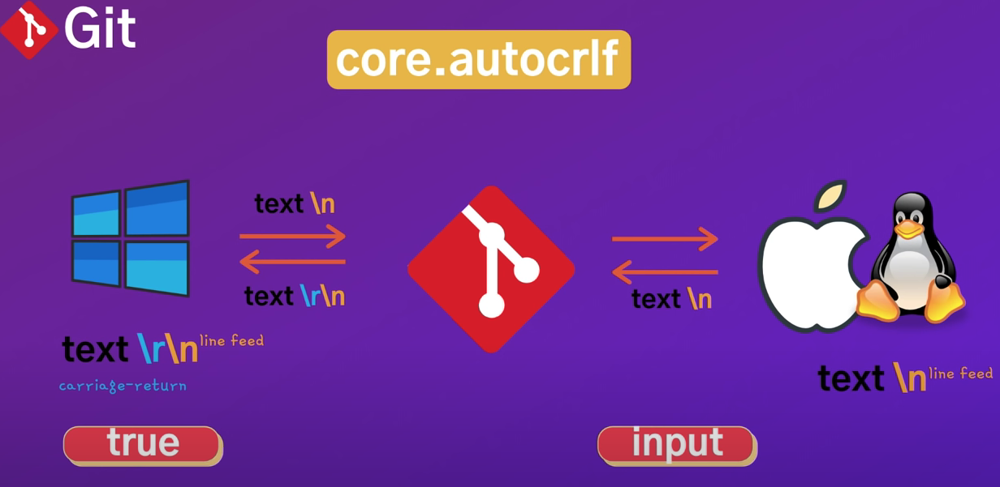
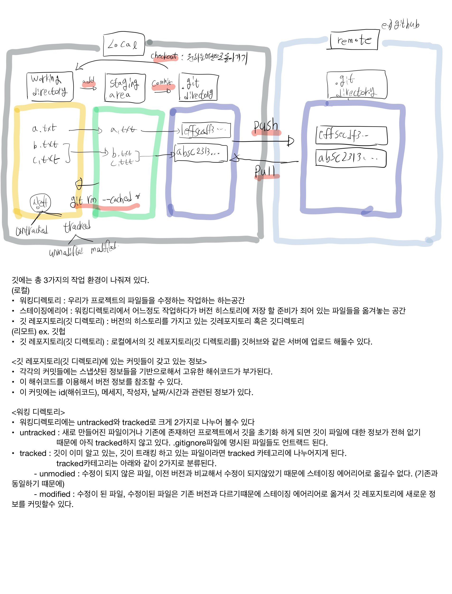

## git 세팅

### .gitconfig

> 깃을 설치하게 되면 깃에 관련된 모든 환경 설정이 `.gitconfig` 라는 파일안에 저장이 된다.
>
> 아래와 같은 명령어로 터미널에서 간단하게 확인할수 있다.

```
git config --list // 간단하게 터미널에서 설정을 확인하기.
git config --global core.editor "vi" //vscode와 연동 세팅
git config --global core.editor "code" //vscode와 연동 세팅
git config --global core.editor "code --wait" //vscode와 연동 세팅, +에디터(vscdode)가 종료되어야 터미널이 다시 활성화된다.(나같은경우 --wait옵션은 사용안함.)
git config --global -e // 에디터창(vi or vscode)통해 .gitconfig 파일을 실행한다.
```

- 깃에 관련되 모든 설정을 확인할 수 있다.
- `--global` 옵션은 전역환경설정을 의미한다.


#### 사용자 이름, 이메일 설정

```
git config --global user.name "younoah" // 이름 설정
git config --global user.email "kr_uno_10@naver.com" // 이메일 설정
git config user.name // 설정된 이름 출력
git config user.email // 설정된 이메일 출력
```


### 운영체제별 설정



```
git config --global core.authcrlf input // mac
git config --global core.authcrlf true // window
```

- 운영체제 마다 에디터에서 새로운 줄바꿈을 할 때 들어가는 문자열이 달라진다.
- 윈도우에서는 작성한 텍스트 뒤에  `\r` (carriage-return), `\n` (line-feed) 가 동시에 들어가는 반면에
- 맥에서는 작성한 텍스트뒤에   `\n` (line-feed) 1개만 들어가게된다.
- 이런 차이점 때문에 깃 레파지토리를 다양한 운영체제에서 쓰는 경우 내가 수정하지 않았음에도 불구하 줄바꿈 문자열이 달라져서 깃히스토리나 깃블레을 보는데 문제가 있을수 있다.
- `autocrlf` 옵션이 이것을 수정할 수 있는 속성이다.
- 윈도우에서 `true` 로 설정하게 되면 깃에 저장할때에는 `\r` (carriage-return) 을 삭제하게 되고 다시 깃에서 뒨도우로 가져올 때는 자동으로 `\r` (carriage-return)을 붙여준다.
- 맥에서는 `input` 으로 설정하게 되면 깃에서 받아 올 때는 별다른 수정이 일어나지 않지만 깃에 저장할 때는 `\r` (carriage-return)을 삭제 해준다.
- 맥에서 `\r` (carriage-return)이 텍스트 뒤에 붙지 않음에도 불구하고 설정하는 이유는 맥에서 이메일을 받아 온 텍스트를 복사해서 붙여넣을 때 실수로 `\r` (carriage-return)이 들어갈 수 있기 때문이다.


### git 명령어 구조

```
git 명령어 -축약옵션 --비축약옵션
```

- 깃 명령어는 위와 같은 구조로 구성된다.


### git 시작하기

기본적으로 깃을 관리하기 위한 디렉토리를 생성한다.

```
mkdir projects // 프로젝트들을 관리하기위한 디렉토리
cd projects
mkdir git // 깃이라는 디렉토리를 생성하여 이 디렉토리에서 깃을 관리한다.
cd git
```

깃 초기화.

```
git init // 현재 디렉토리에 git을 초기화(세팅)한다.
ls -al // 해당 명령어를 치면 .git폴더가 생성되어 git일 잘 설정되어 있는것을 확인할 수 있다.
rm -rf .git // 숨겨진 깃폴더를 삭제함으로써 해당 디렉토리에 깃을 삭제한다.(더이상 깃프로젝트가 아니다.)
```

- .git폴더 안에는 현재 디렉토리에 설정된 git에 내부 구현 사항이나 관련된 모든 정보가 담겨있다.
- git을 초기화 하면 기본적으로 `master` 브랜치가 생성이 된다.
- `master` 브랜치는 해당 깃에 가장 기본적인 최고관리자 격인 브랜치인다.


### git alias

> 깃에서 자주사용하는 명령어를 좀더 빠르게 쓰기 위해서는 alias를 통해 단축해서 사용할 수 있다.

```
git config --global alias.st status
```

- `git status` 명령어를 `git st` 로 단축해서 사용할 수 있다.


### git 명령어 사용법 검색

1. 명령어

	```
	git config --h
	```

	- 터미널을 통해서 간단하게 깃 명령어, 옵션이 어떤게 있는지 확인할 있다.

2. 깃 공식 사이트 (https://git-scm.com/docs)

	- 깃 공식 사이트 레퍼런스에서 어떤 명령어와 옵션이 있는지 자세히 확인할 수 있다.


## git 시작하기

### git workflow



