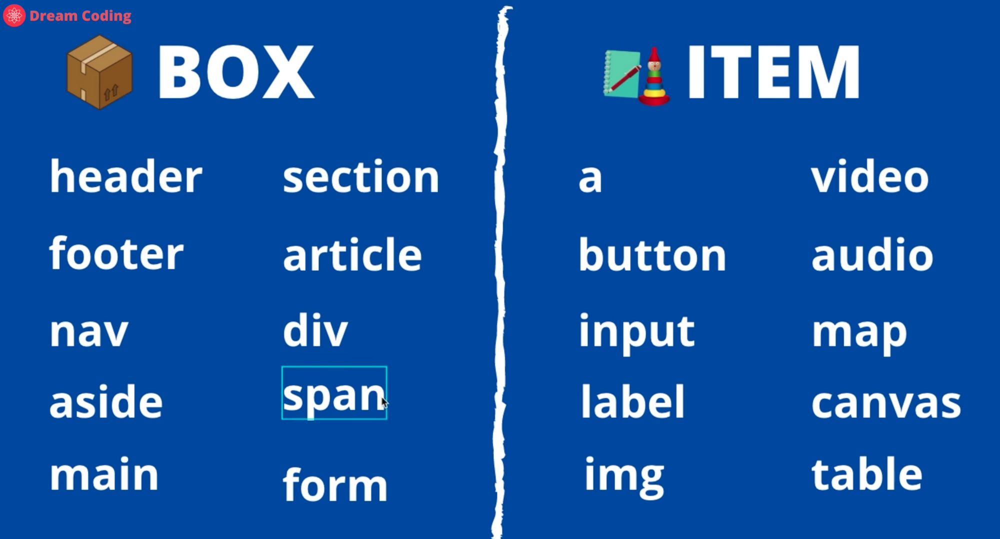
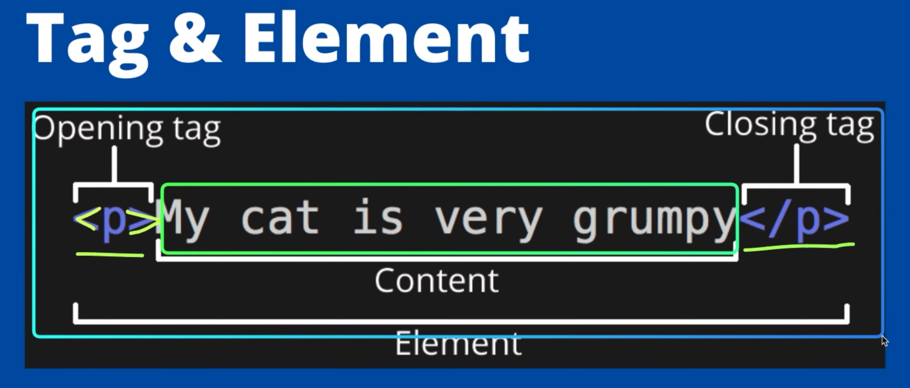
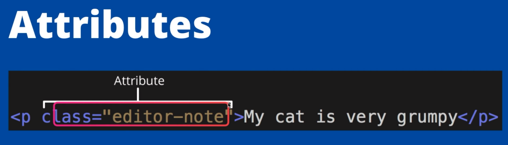

## HTML 파일의 구조

```html
<!DOCTYPE html> // 관습적으로 document 타입은 html이다라고 명시
<html> // html은 head와 body로 나뉘어진다.
<head> // 타이틀, 제목, 부가설명 등의 메타정보만을 포함한다.
	<meta charset="UTF-8"> //문자포맷을 UTF-8로 세팅한다.UTF-8은 현존하는 모든언어를 지원한다.
	<meta name="viewport" content="width=device-width, initial-scale=1.0">
	<title>Document</title> //브라우저 탭 부분에 보이는 제목
</head>
<body> // 사용자에게 보여지는 최상위의 컨테이너, body안에 작성된 내용이 화면에 보여진다. 
	
</body>
</html>
```


## 태그



태그는 박스 혹은 아이템 2가지로 분류가 된다.

- Box : 어떻게 아이템들을 배치할지 나누어주는 태그

- Item : 사용자들에게 보여지는 태그
	- Block : 한 줄에 하나만 배치가 가능하다. (다음 내용을 자동으로 줄바꿈을 한다.)
	- inline : 한 줄에 여러개 배치가 가능하다.


## 블럭(Block)과 인라인(Inline)


태그들은 한줄을 차지하는 Block인지 한줄에 여러개가 배치될 수 있는 Inline인지 레벨이 정해저 있다.  css명령어를 통해서 변경도 가능하다.


### 블록요소 (block element)

- 블록 요소는 모든 **인라인 요소를 포함**할 수 있고 다른 **블록 요소도 일부 포함** 할 수 있다. 
- **가로폭 전체의 넓이를 가지는 직사각형 형태**이며 `width`, `height`, `margin`, `padding` 등으로 레이아웃을 수정할 수 있다. 
- 블록 요소 다음에는 **줄바꿈**이 이루어 진다.

`display:block` CSS명령어로 블록으로 변경 할 수 있다.

```html
div {display:block}
```


**블록 요소인 태그 종류**

> `address`, `article`, `aside`, `audio`, `blockquote`, `canvas`, `dd`, `div`, `dl`, `fieldset`, `figcaption`, `figure`, `footer`, `form`, `h1`, `h2`, `h3`, `h4`, `h5`, `h6`, `header`, `hgroup`, `hr`, `noscript`, `ol`, `output`, `p`, `pre`, `section`, `table`, `ul`, `video`


### 인라인 요쇼 (inline element)

- 인라인 요소는 **항상 블록 요소안에 포함**되어 있으며 **인라인 요소안에 다른 인라인 요소가 포함**될 수 있다. 

- 컨텐츠가 끝나는 지점까지를 넓이로 가지게 된다. 

- 임의로 `width`, `height`로 변형을 줄 수가 없다. 

- 인라인 요소는 `line-height`로 줄의 높낮이를 조절할 수 있고 `text-align`으로 텍스트의 종앙, 좌,우측 정렬을 할 수 있다. 

- 인라인 요소 다음에는 **줄바꿈이 없고** 우측으로 바로 이어서 표시가 된다.

`display:inline` CSS명령어로 인라인으로 변경 할 수 있다.

```html
div {display:inline}
```


**인라인 요소인 태그 종류**

> `a`, `abbr`, `acronym`, `b`, `bdo`, `big`, `br`, `button`, `cite`, `code`, `dfn`, `em`, `i`, `img`, `input`, `kbd`, `label`, `map`, `object`, `q`, `samp`, `small`, `script`, `select`, `span`, `strong`, `sub`, `sup`, `textarea`, `tt`, `var`


### 인라인-블록 요쇼 (inline-block element)

- 기본적으로 inline요소를 따르지만 block처럼 width나 height를 줄 수 있다.
- 한마디로 크기를 가지되, inline태그 처럼 줄바꿈이 일어나지 않고 옆으로 쭉 나열된다.

`display:inline-block` CSS명령어로 인라인-블록으로 변경 할 수 있다.

```html
div {display:inline-block}
```


## 박스모델


웹사이트는 이미지와 같인 어떻게 배치할지를 정하는 태그가 있다. 해당 태그들을 이용해서 웹사이트의 구조를 짤수 있다.


## 태그의 구조와 속성

**태그의 구조**



태그 안에는 Content이고, 이 하나의 태그 정어리가 하나의 Element이다.


**태그의 속성**



태그안에는 속성을 넣어 줄수 있다.


## 자주 사용하는 태그 

> div & sapn : 아이템들을 묶어서 스타일링을 할때 사용한다.
>
> article : 여러가지 아이템들을 재사용 가능하도록 그룹화해 놓은 것

```html
<p> 문단을 정의
<b> 볼드체
<span> inline level의 태그 -> 줄바꿈 일어나지 않음
<div> block level의 태그 -> 줄바꿈 일어남

<ol> 번호가 있는 리스트
<ul> 번호가 없는 리스트

<input for =" "> Name: </label>
<input id = "input_name" type="button / password / checkbox....">
#input tag가 여러개가 있을 수 있으므로 고유한 식별자를 넣어줘야 한다
```


## 참고자료

- [MDN Wwb Docs](https://developer.mozilla.org/en-US/docs/Web/HTML)

> html의 태그들과 태그의 속성들을 설명하고 예시까지 보여준다.
>
> 태그를 사용할 때는 MDN사이틑 켜놓고 같이 사용하면 도움이 많이된다.

