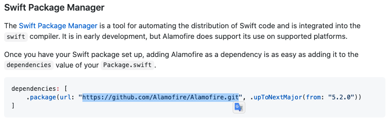

## Swift Package Manager 세팅방법

> 설치하고자 하는 팟의 소개페이지(깃허브)에서 Swift Package Manager 설명란에 주소를 복사해서 붙어넣는다.
>
> ex) https://github.com/Alamofire/Alamofire

> 설치하고자 하는 팟의 소개페이지(깃허브)에서 Swift Package Manager에서 제시하는 최신버전으로 설정한다.

> 완료!